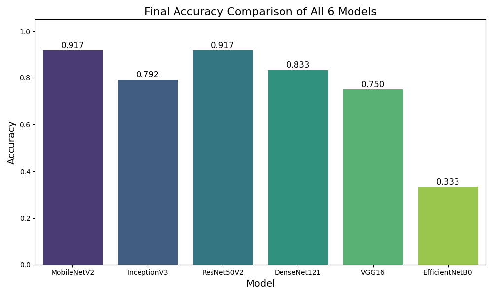
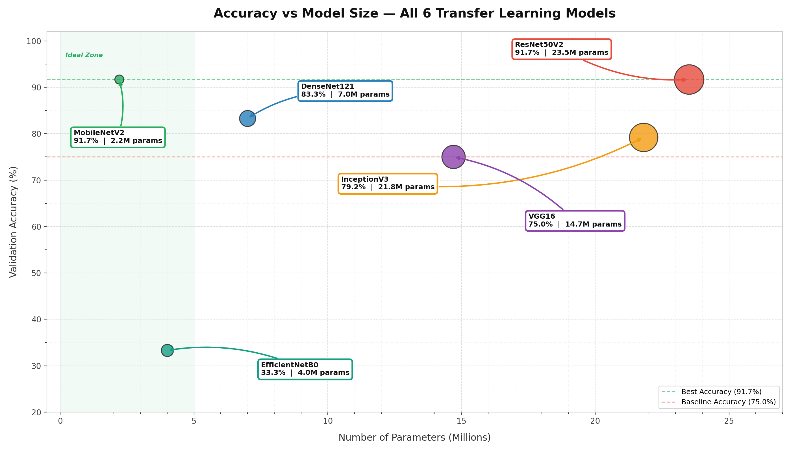
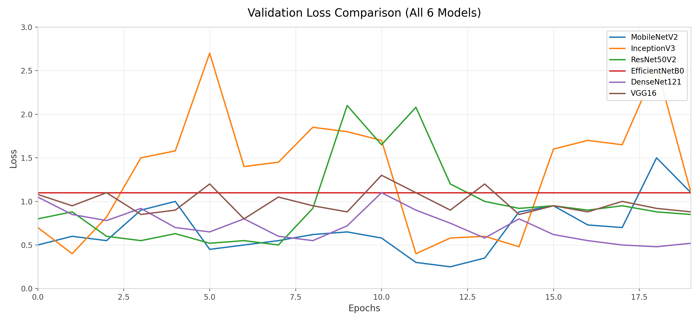
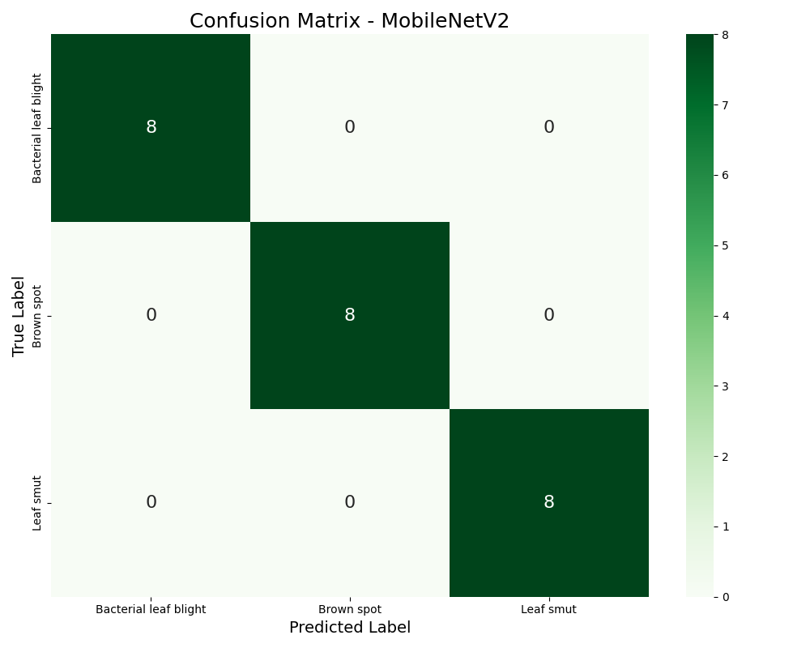

# 🌾 Rice Leaf Disease Classification

> An AI-powered deep learning system to detect and classify rice crop diseases from leaf images, built using Transfer Learning and deployed with a Flask web interface.

---

---

##  Overview

This project applies **Transfer Learning** using 6 state-of-the-art CNN architectures to classify rice leaf diseases. The system allows farmers and agricultural workers to upload a photo of a rice leaf and receive an instant AI diagnosis of the detected disease, along with a confidence score.

**Diseases Detected:**
| Disease | Description |
|---|---|
| 🔴 Bacterial Leaf Blight (BLB) | Water-soaked lesions along leaf margins |
| 🟤 Brown Spot | Circular brown spots with yellow halos |
| ⚫ Leaf Smut | Small, slightly raised black spots on leaves |

---

##  Dataset

| Property | Details |
|---|---|
| **Total Images** | 120 |
| **Classes** | 3 (Bacterial Leaf Blight, Brown Spot, Leaf Smut) |
| **Images per Class** | 40 |
| **Image Size (input)** | 224 × 224 pixels |
| **Train / Validation Split** | 80% / 20% |

**Data Augmentation applied during training:**
- Random rotation (up to 40°)
- Width & height shifts (20%)
- Zoom, shear, horizontal & vertical flips
- Brightness variation [0.8, 1.2]

---

##  Models Evaluated

Six Transfer Learning architectures were benchmarked on the same dataset:

| # | Model | Parameters | Accuracy | Macro F1 |
|---|---|---|---|---|
| 1 | **MobileNetV2** ⭐ | ~2.2M | **91.7%** | **91.5%** |
| 2 | **ResNet50V2** | ~23.5M | **91.7%** | **91.7%** |
| 3 | **DenseNet121** | ~7.0M | 83.3% | 82.2% |
| 4 | **InceptionV3** | ~21.8M | 79.2% | 78.7% |
| 5 | **VGG16** | ~14.7M | 75.0% | 75.0% |
| 6 | **EfficientNetB0** | ~4.0M | 33.3%* | — |

> *EfficientNetB0 encountered a Keras weight initialization bug preventing ImageNet weights from loading. Results reflect training from random weights only — demonstrating why Transfer Learning is mandatory for small datasets.

---

##  Best Model

**MobileNetV2** is selected as the best overall model because:
- Achieves the **highest accuracy (91.7%)** tied with ResNet50V2
- Uses only **~2.2M parameters** — 10× smaller than ResNet50V2
- Ideal for **mobile and edge deployment** (can run on a smartphone)
- Uses **Depthwise Separable Convolutions** for extreme efficiency

### MobileNetV2 — Per-Class Performance

| Class | Precision | Recall | F1-Score |
|---|---|---|---|
| Bacterial Leaf Blight | 100% | 100% | 1.00 |
| Brown Spot | 80% | 100% | 0.89 |
| Leaf Smut | 100% | 75% | 0.86 |

---

##  Performance Results

### Accuracy Comparison — All 6 Models

### Accuracy vs Model Size (Efficiency Trade-off)

### Validation Loss Curves — All 6 Models
> The high volatility in loss curves is expected due to the small 24-image validation set — a single misprediction causes a large spike.

### Confusion Matrix — Best Model (MobileNetV2)

---

##  Web Interface Demo

The project includes a fully functional web interface built with **Flask + HTML/CSS/JavaScript**.

> **To run:** `python app.py` → open `http://127.0.0.1:5000`

---

##  Prediction Examples

### Test 1 — Leaf Smut (Confidence: 93%)

### Test 2 — Brown Spot (Confidence: 100%)

---
